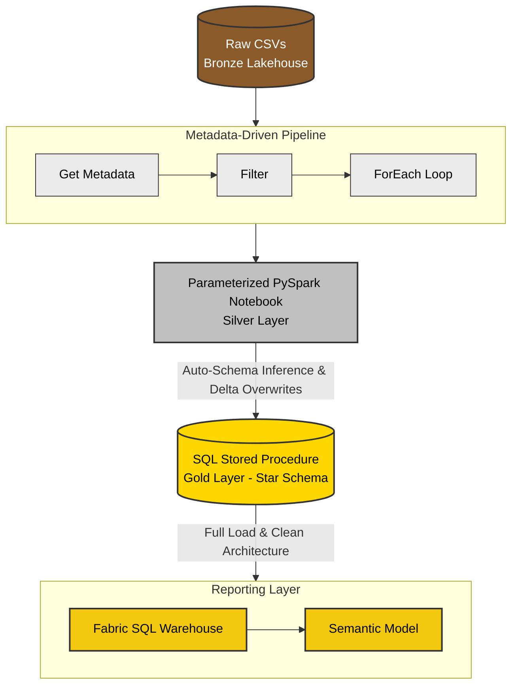

# End-to-End Medallion Data Platform in Microsoft Fabric (UIDAI Aadhaar Data)

An enterprise-grade, metadata-driven data engineering pipeline built using **Microsoft Fabric**. This project ingests, transforms, and models public Aadhaar enrolment, demographic, and biometric datasets into a reporting-ready Star Schema following the Medallion Architecture (Bronze ➔ Silver ➔ Gold).

---

## Architecture & Tech Stack
* **Cloud Platform:** Microsoft Fabric (Lakehouse, Warehouse, Data Pipelines, Notebooks)
* **Languages & Engines:** PySpark, T-SQL, Delta Lake
* **Orchestration:** Fabric Data Pipelines (`Get Metadata`, `Filter`, `ForEach`, `Stored Procedure` activities)

---

## Data Pipeline Flow

---

## Project Structure
1. **Bronze Layer:** Ingests raw multi-part CSV files (`enrolment`, `demographic`, `biometric`) and reference files (`states`) into the Lakehouse file storage.
2. **Silver Layer:** 
   * A single parameterized PySpark notebook handles dynamic file reading using wildcards (`*.csv`) and schema inference.
   * Automated via a metadata-driven Fabric pipeline using `Get Metadata` and `ForEach` iteration to loop through dataset folders.
3. **Gold Layer:** 
   * A modular T-SQL Stored Procedure (`usp_Load_Gold_Model_Full`) that performs a full-reload pattern.
   * Cleans, aggregates, and transforms data into standardized dimension tables (`Dim_Date`, `Dim_Location`) and a consolidated fact table (`Fact_Aadhaar_Activity`).

---

## Key Engineering Highlights
* **Metadata-Driven Automation:** Replaced redundant, manual pipelines with a dynamic loop that processes multiple distinct data domains using pipeline parameters .
* **Optimized SQL Modeling:** Utilized Common Table Expressions (CTEs) and pre-aggregation before `FULL OUTER JOIN` operations to completely eliminate cartesian explosions and row duplication.
* **Fabric-Native Optimization:** Leveraged Delta Lake transaction formats and Fabric Warehouse V-Order storage for high-performance querying without manual indexing overhead.

